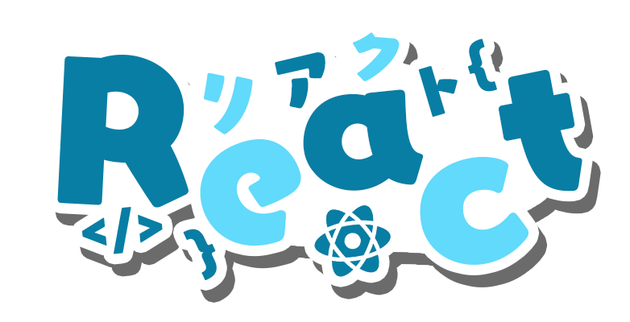
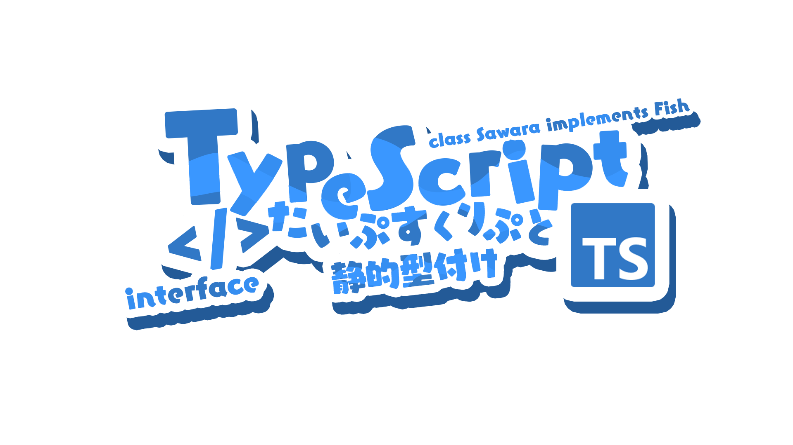
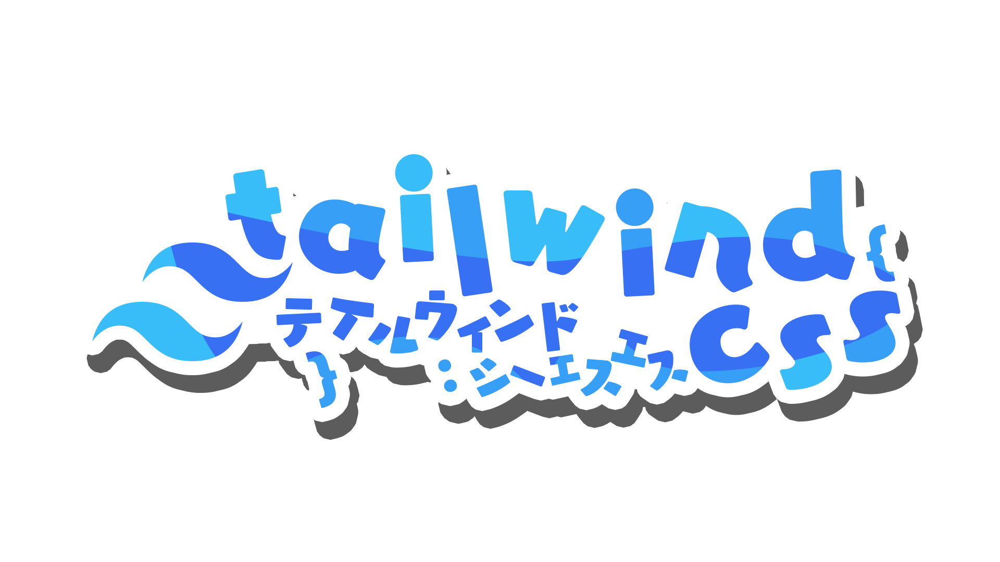
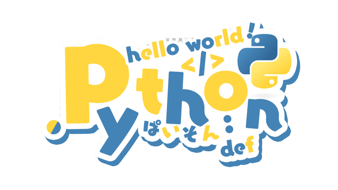
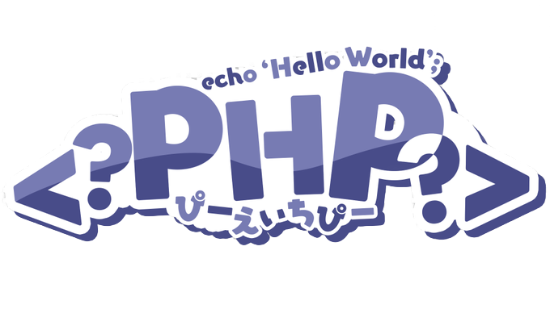
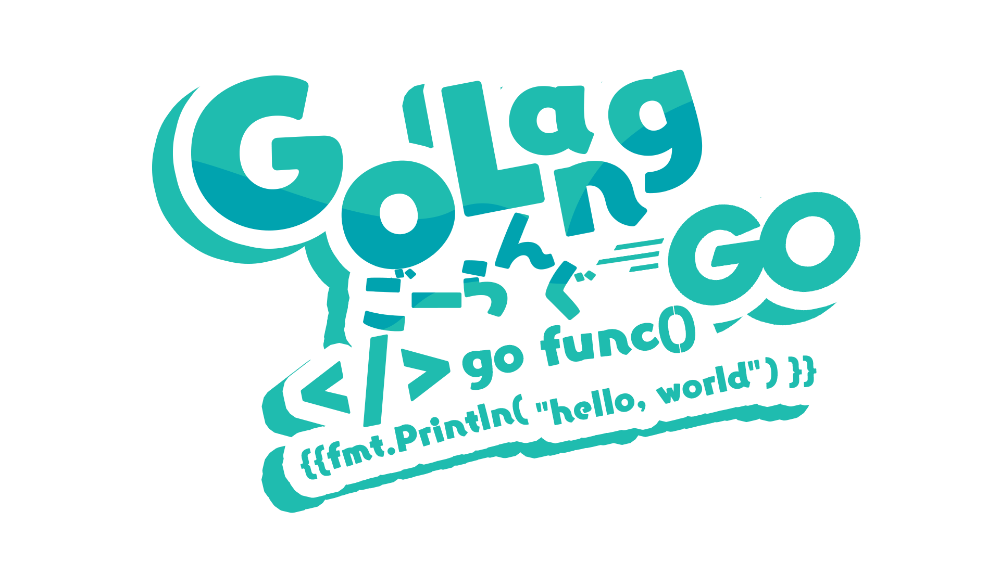

## Hey There!  

engineering student based in **Pereira (Colombia)**.
- *(Systems and Computation Engineering at Universidad Tecnológica de Pereira)*

I'm currently **looking for a job**, but in the meantime I'm developing whatever I find fun or useful.
I hope you'll find these tools fun and useful as well. 🙂

---

### Which technologies do you use?

I’m not tied to any single tech stack. Since I usually work solo, I choose the most effective tool for each problem. 🔬

  
  
  
  
  
  

---

### What is your ideal job?

Welp, I’d like to work **part-time (20–25 hrs/week)** with flexible schedules, mainly because I want to finish university. 👨‍🎓
Aside from that, I'm open to learning anything — I'm curious by nature. 🔍

---

### What are you currently working on?

These past week i've been doing a bunch of stuff that are currently on my pinned projects, aside from that i've been studying computer grafichs to see if i like that topic

---

### About me

* I'm a documentation freak 🗣️
* I play guitar in a band 🎸
* I'm mostly a dog person 🐕
* Into manga (A LOT) 📚
* I used to study journalism 🎤
